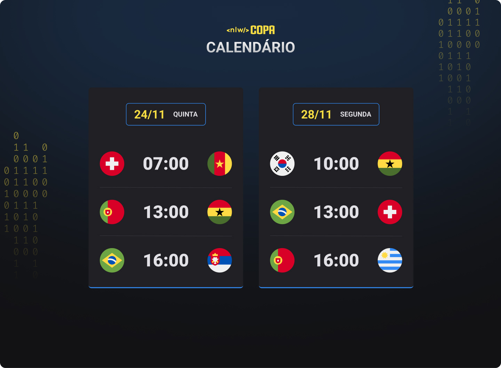

<h1 align="center"> NLW #10 Copa Calendar 2022</h1>

    Evento exclusivo e gratuito, promovido pela Rocketseat para ensino de tecnologias WEB.

    <a href="#-tecnologias">Tecnologias</a>&nbsp;&nbsp;&nbsp;|&nbsp;&nbsp;&nbsp;
    <a href="#-projeto">Projeto</a>&nbsp;&nbsp;&nbsp;|&nbsp;&nbsp;&nbsp;
    <a href="#-layout">Layout</a>&nbsp;&nbsp;&nbsp;|&nbsp;&nbsp;&nbsp;
    <a href="#memo-licença">Licença</a>

 

    

## 🚀 Tecnologias

Esse projeto foi desenvolvido com as seguintes tecnologias:

- HTML e CSS
- JavaScript
- Git e GitHub

## 💻 Projeto

O Calendario da Copa e um projeto que mostra os jogos da Copa de 2022.

## 📋 Layout 

Voce pode visualizar o layout do projeto atraves [DESSE LINK](https://www.figma.com/file/y759axeSE3TtFuqqgK6CUN/Calendário-de-Jogos/duplicate). E necessario ter conta no [Figma](https://figma.com) para acessa-lo.

---

Feito com 💜 by Phelipe Pereira :wave:
